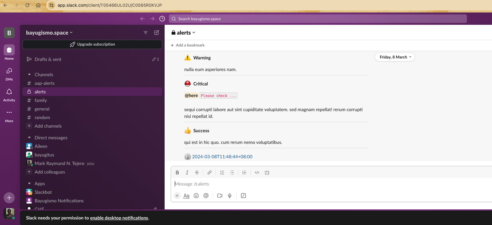

# slack
Package enables notify message to a Slack Channel via Slack API.
- Prerequisite must have a Slack Account


### How to use the package
```go

import (
    "log"
    "github.com/bayugyug/slack"
)


```


### How to send a message

```go


// init
servicePath := `/services/T018XXXXXXXX/86YYYYYYYYYYYYY/{slack-api-token}`
alert := slack.NewNotification(servicePath)


// push
err := alert.Notify([]*slack.Payload{
    {
        Title:       "Event Push",
        Message:     fake.Sentences(),
        WithDivider: true,
        Icon:        slack.IconTypeSpeechBalloon,
    },
    {
        Title:       "Notify",
        Message:     fake.Sentences(),
        WithDivider: true,
        Icon:        slack.IconTypeHeart,
    },
    {
        Title:       "Star",
        Message:     fake.Sentences(),
        WithDivider: true,
        Icon:        slack.IconTypeStar,
    },
    {
        Title:       "Warning",
        Message:     fake.Sentences(),
        WithDivider: true,
        Icon:        slack.IconTypeWarning,
    },
    {
        Title:       "Critical",
        Message:     fake.Sentences(),
        WithDivider: true,
        Priority:    slack.PriorityCritical,
        Icon:        slack.IconTypeCritical,
        Here:        "Please check ...",
    },
    {
        Title:       "Success",
        Message:     fake.Sentences(),
        WithDivider: true,
        Icon:        slack.IconTypeThumbsUp,
    },
})

if err != nil{
    log.Println("fail",err)
    return
}

log.Println("sent success")

```

### Simulate sending alert message
    - export token to ENVT
        ex:
            export SLACK_TOKEN='/services/zzzzzz/yyyy/xxxxx'

```shell

    # run the simulator

    go run cmd/simulator/main.go

```


### Screenshot



### [Configure the webhook](https://api.slack.com/messaging/webhooks)
